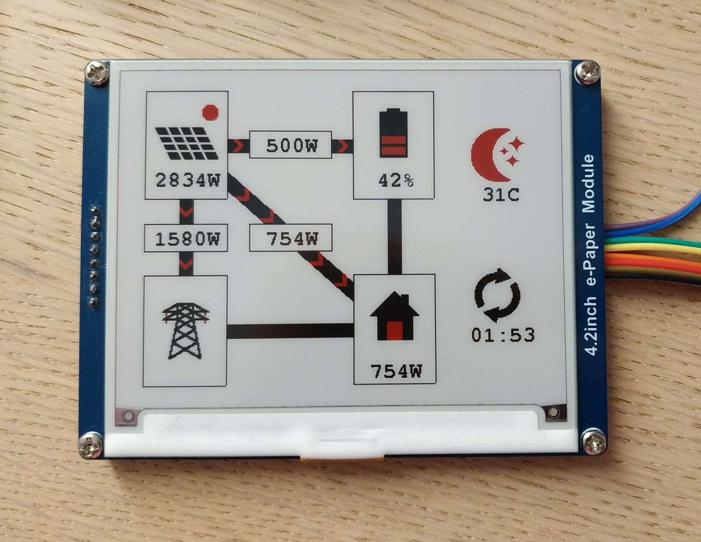

# enmon_display
Photovoltaic plant energy monitoring dashboard, using an ESP32C3 microcontroller and a 4.2-inch color ePaper display.  
Designed to minimize power consumption for battery-powered operation.

## Target hardware
- Microcontroller: ESP32C3 (Xiao ESP32C3 development board)
- Display: Waveshare 4.2inch e-Paper (B)

## Required Arduino libraries
- Adafruit_GFX
- ArduinoJSON
- PubSubClient MQTT

## Configuration
The necessary firmware configuration can be provided through `src/Config.h`.
